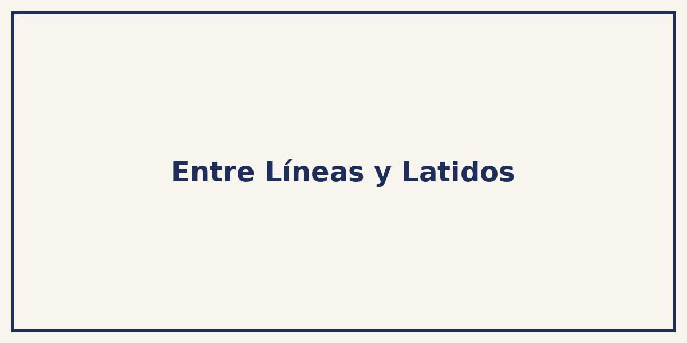
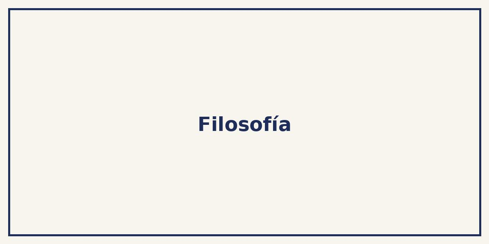
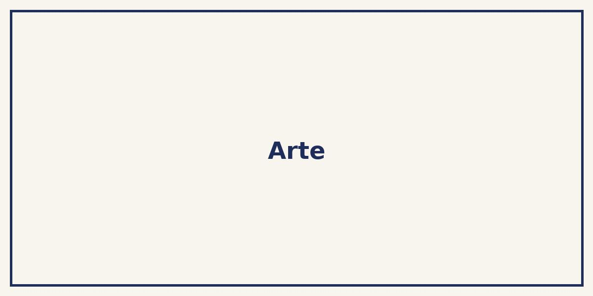
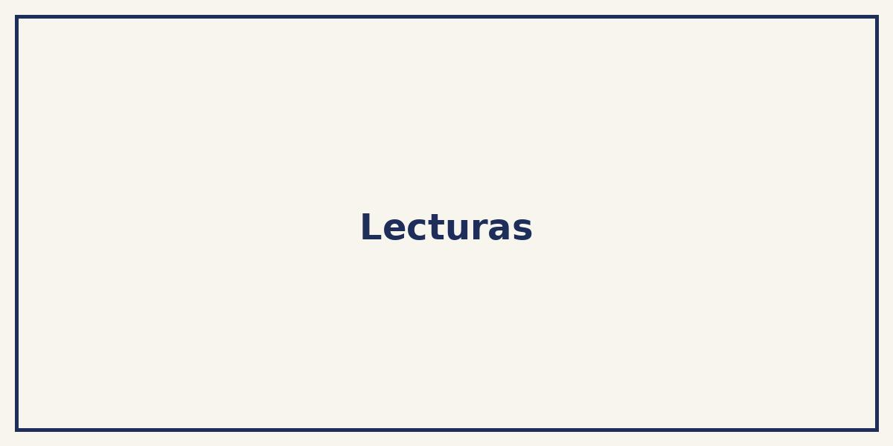

<html lang="es">
<head>
  <meta charset="UTF-8">
  <meta name="viewport" content="width=device-width, initial-scale=1.0">
  <title>Entre Líneas y Latidos</title>
  <link rel="stylesheet" href="https://cdnjs.cloudflare.com/ajax/libs/font-awesome/6.5.0/css/all.min.css">
  
</head>
<body>

  <header>
    <h1><i class="fas fa-heartbeat icon"></i>Entre Líneas y Latidos</h1>
    
"Todos los días construyes tu identidad"

    
  </header>

  <nav>
    <a href="#filosofia"><i class="fas fa-lightbulb icon"></i>Filosofía</a>
    <a href="#arte"><i class="fas fa-palette icon"></i>Arte</a>
    <a href="#musica"><i class="fas fa-music icon"></i>Música</a>
    <a href="#lecturas"><i class="fas fa-book icon"></i>Lecturas</a>
    <a href="#contacto"><i class="fas fa-envelope icon"></i>Contacto</a>
  </nav>

  <section id="filosofia">
    <h2><i class="fas fa-brain icon"></i>Filosofía</h2>
    
Reflexiones inspiradas en Albert Camus, Séneca y la vida cotidiana.

    
  </section>

  <section id="arte">
    <h2><i class="fas fa-paint-brush icon"></i>Arte</h2>
    
Ideas, artistas, emociones y la belleza de observar el mundo con otros ojos.

    
  </section>

  <section id="musica">
    <h2><i class="fas fa-headphones-alt icon"></i>Música</h2>
    
Desde Luis Miguel hasta Kendrick Lamar. Canciones que construyen memorias.

    <iframe src="https://open.spotify.com/embed/playlist/37i9dQZF1DWXRqgorJj26U" allowfullscreen></iframe>
  </section>

  <section id="lecturas">
    <h2><i class="fas fa-book-reader icon"></i>Lecturas</h2>
    
Libros que dejan huella: El extranjero, Rulfo, Cortázar y más.

    
  </section>

  <section id="contacto">
    <h2><i class="fas fa-comments icon"></i>Contacto</h2>
    
¿Te gustaría colaborar o escribirme? ¡Aquí puedes hacerlo!

    <form action="#" method="post">
      <input type="text" name="nombre" placeholder="Tu nombre" required>
      <input type="email" name="email" placeholder="Tu correo electrónico" required>
      <textarea name="mensaje" rows="4" placeholder="Tu mensaje..." required></textarea>
      <button type="submit"><i class="fas fa-paper-plane"></i> Enviar</button>
    </form>
  </section>

  <footer>
    
&copy; 2025 Entre Líneas y Latidos

  </footer>

</body>
</html>
